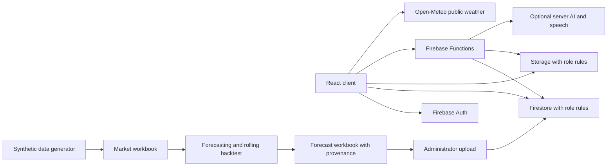

# Architecture

## Application and access

The Vite application initialises Firebase in `src/config/firebase.js`. Its default configuration connects every Firebase SDK to loopback emulators under a `demo-` project. A real Firebase project requires an explicit environment configuration and `VITE_USE_EMULATORS=false`.

Firebase Auth establishes identity. Profiles in `users/{uid}` provide the role and approval status. Firestore and Storage rules enforce access on the server. Phone-derived login identifiers are kept compatible with existing accounts. With no registration settings document, new registration is closed.

## Expert review

Farmers submit a photo and structured observations. Experts review the queue and publish a result that the farmer can read. The consultation workstream uses a transactional case-claim callable to avoid two experts claiming the same request.

The browser classifier is a separate admin tool. Its bundled assets are hashed before a build and verified during loading. A classifier result is not automatically substituted for an expert diagnosis.

Training-set exports and model-registry records support a manual model-development workflow. Automatic retraining, independent classifier evaluation and registry-based replacement of the active browser model are not established by this repository.

## Forecasts

The Python pipeline owns generation, training, evaluation and Excel export. It uses generated history with explicitly documented assumptions. Backtests split data by time and season. Their metrics are synthetic evaluation results.

`forecastSheets/{grade}` contains uploaded rows and provenance. The admin service validates all three grade sheets before a single batch write. The public page reads forecast sheets without authentication. Farmers can compare reported prices only when market, grade and date match.

The workbook `About` sheet uses key/value rows for `provenance`, `sourceName`, `dataCutoff`, `generatedAt`, `modelVersion` and `seed`. The importer preserves these values. Synthetic forecast views visibly identify the data as simulated.

The unused monthly-average producers, their historical CSV, unused subscriptions and stale fallback have been retired. Supported Functions and the current forecast workbook path remain.

## Weather, climate and devices

Weather comes from public Open-Meteo requests and cached server context. Weather failures and sample climate data retain explicit unavailable/sample states. Regional AI advice and speech call external providers only through server Functions.

The hydroponic module stores device readings and pump commands. The ESP32 sketch contains placeholders. Hardware, authenticated device sessions, token refresh and physical pump operation require separate testing on a configured device.

## Delivery

Root, Functions and rules-test dependency lockfiles are tracked. GitHub Actions runs JavaScript checks, rules tests with Java 21, Python forecasting tests, and the workbook validation contract. No workflow deploys the app automatically.

Tool references: [Firebase Local Emulator Suite](https://firebase.google.com/docs/emulator-suite/install_and_configure), [Node setup action](https://github.com/actions/setup-node), [Python setup action](https://github.com/actions/setup-python), [Java setup action](https://github.com/actions/setup-java).
